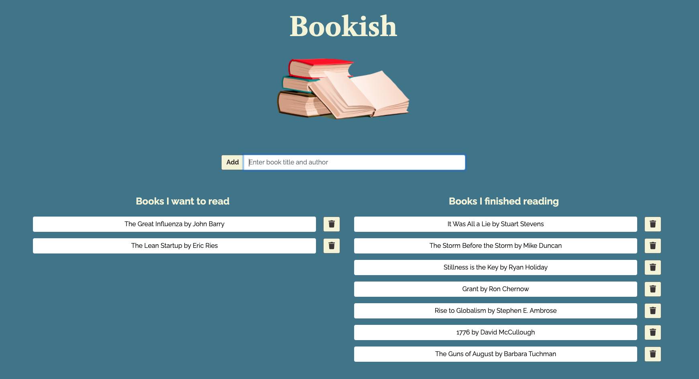

# Bookish

## Table of Contents
* [Project Summary](#project-summary)
* [How to Access](#how-to-access)
* [Technologies Used](#technologies-used)
* [About Me](#about-me)
* [Screenshots](#screenshots)
* [Code Snippets](#code-snippets)

## Project Summary
Bookish is a reading list application that allows you to keep a list of which books you have read, and it allows you to add new books that you want to read later.

## How to Access
* [Bookish](https://vast-refuge-78256.herokuapp.com/)

## Technologies Used
* [JavaScript](https://developer.mozilla.org/en-US/docs/Web/JavaScript)
* [Node](https://nodejs.org/en/)
* [Express](https://expressjs.com/)
* [MySQL](https://www.mysql.com/)
* [Handlebars](https://handlebarsjs.com/)

## About Me
* [LinkedIn](https://www.linkedin.com/in/the-real-jordan-kelly/)
* [GitHub](https://github.com/profjjk)

## Screenshots


## Code Snippets
This is the client-side code for making a PUT request to the server...
```
  $(document.body).on("click", '.book', (event) => {
    event.preventDefault();

    // Get id and status.
    const id = event.target.getAttribute('data-id')
    const status = event.target.getAttribute('data-finished');
    let updBook;

    // Change status.
    if (status === "false") {
      updBook = {
        finished: true,
      }
    } else if (status === "true") {
      updBook = {
        finished: false,
      }
    }

    // Send put request.
    $.ajax({
      url: `/api/books/${id}`,
      type: `PUT`,
      data: updBook,
    }).then(response => {
      location.reload('/');
    });
  });
```
... This is the server-side code for handling that PUT request...
```
router.put("/api/books/:id", function(req, res) {
  book.update(req.params.id, req.body.finished, function(result) {
    if (result.changedRows === 0) {
      return res.status(404).end();
    }
    res.status(200).end();
  })
})
```
... And this code completes the PUT request by making the requested modification to the database.
```
update: function(id, boolean, cb) {
    let queryString = `
    UPDATE books SET finished = ${boolean}
    WHERE id = ?;`
    connection.query(queryString, id, function(err, res) {
      if (err) throw err;
      cb(res);
    })
```

[](https://opensource.org/licenses/MIT)